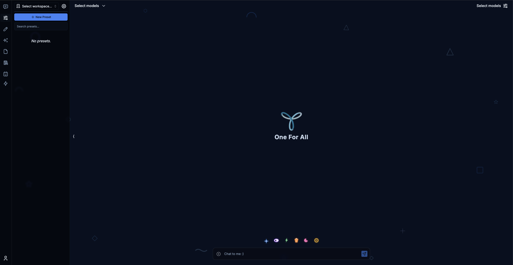

# YOM — One For All

**YOM** is a privacy-first, local-only AI chat application. No accounts, no database, no data leaving your machine. Just you and your chosen AI model.

![One For All UI]


---

## Features

- **Privacy-First** — No central database. Chat history lives only in memory and is cleared on refresh.
- **Local API Keys** — Keys are stored in your browser's `localStorage` only.
- **Multi-Model Support** — OpenAI, Anthropic (Claude), Google Gemini, Groq, Mistral, Perplexity, OpenRouter, and local models via Ollama.
- **Glass UI** — Dark navy glassmorphism design with interactive doodles and animated input companions.

---

## Prerequisites

| Requirement | Version | Notes |
|---|---|---|
| Node.js | v18.x or later | Required |
| npm | v9.x or later | Required |
| Supabase | — | Optional — only for auth/persistence |
| Ollama | — | Optional — only for local LLM inference |

---

## Getting Started

### 1. Clone the repository

```bash
git clone <repository-url>
cd chatbot
```

### 2. Set up environment variables

```bash
cp .env.local.example .env.local
```

Open `.env.local` and fill in what you need:

```env
# Required only if using Supabase auth
NEXT_PUBLIC_SUPABASE_URL=
NEXT_PUBLIC_SUPABASE_ANON_KEY=
SUPABASE_SERVICE_ROLE_KEY=

# Optional: pre-fill API keys server-side for all users
# (if left empty, users enter their own keys in the UI)
OPENAI_API_KEY=
ANTHROPIC_API_KEY=
GOOGLE_GEMINI_API_KEY=
GROQ_API_KEY=
MISTRAL_API_KEY=
PERPLEXITY_API_KEY=
OPENROUTER_API_KEY=

# Optional: local Ollama endpoint (default shown)
NEXT_PUBLIC_OLLAMA_URL=http://localhost:11434
```

> **Running without Supabase?** Leave the Supabase variables empty. The app runs in local/ephemeral guest mode — no login required.

### 3. Install dependencies

```bash
npm install
```

### 4. Start the development server

```bash
npm run dev
```

Open [http://localhost:3000](http://localhost:3000) in your browser.

### 5. Build for production

```bash
npm run build
npm start
```

---

## Adding API Keys in the UI

If you didn't set keys in `.env.local`, add them per-session inside the app:

1. Click **Start Chatting** on the home screen.
2. Open **Profile Settings** (bottom-left of the sidebar).
3. Enter keys for the providers you want to use.
4. Keys are saved to `localStorage` — they never leave your machine except when authenticating directly with the provider's API.

---

## Using Ollama (Local Models)

1. Install [Ollama](https://ollama.ai) and pull a model:
   ```bash
   ollama pull llama3
   ```
2. Ensure Ollama is running:
   ```bash
   ollama serve
   ```
3. The app auto-detects models at `http://localhost:11434` (or the value of `NEXT_PUBLIC_OLLAMA_URL`).

---

## Project Structure

```
app/[locale]/          → Next.js App Router pages & layouts
components/
  chat/                → Chat input, messages, settings
  ui/                  → Shared UI (brand, doodles, input orbs, glass panels)
  icons/               → SVG icon components (YOM logo)
context/               → Global state (ChatbotUIContext)
lib/                   → Model lists, API helpers, hooks
public/                → Static assets (yom-logo.png, manifest)
image/                 → Source logo assets
```

---

## Available Scripts

| Command | Description |
|---|---|
| `npm run dev` | Start development server |
| `npm run build` | Build for production |
| `npm start` | Start production server |
| `npm run lint` | Run ESLint |
| `npm run lint:fix` | Auto-fix lint errors |

---

## How It Works

- **Ephemeral by default** — all chat state lives in React memory. Refresh = clean slate.
- **No Supabase required** for basic use — only needed if you want auth or persistent storage.
- **API key flow** — entered in the UI → stored in `localStorage` → forwarded server-side only as request headers through proxy routes in `app/api/chat/`.

---

## License

MIT
